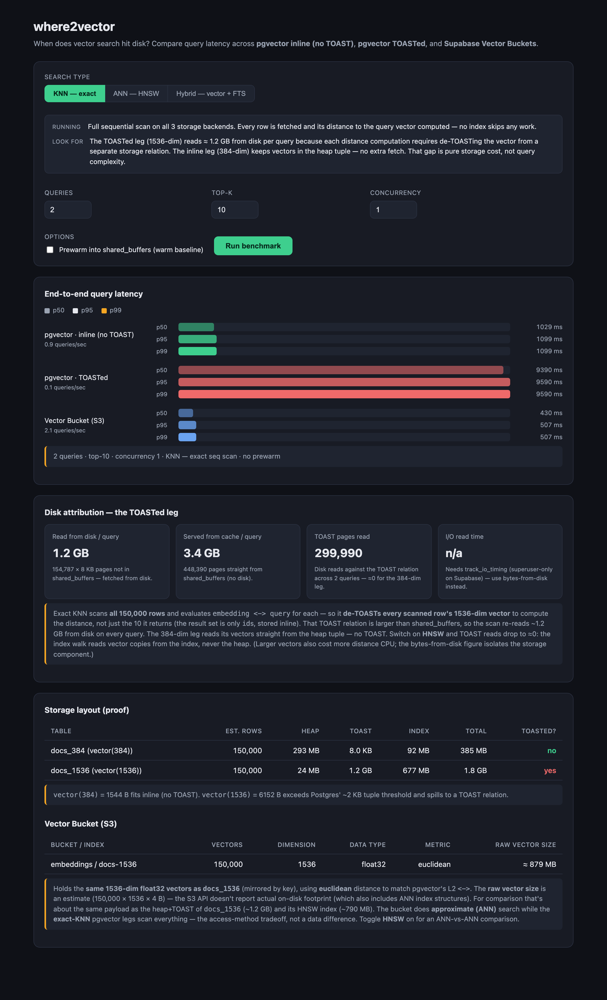
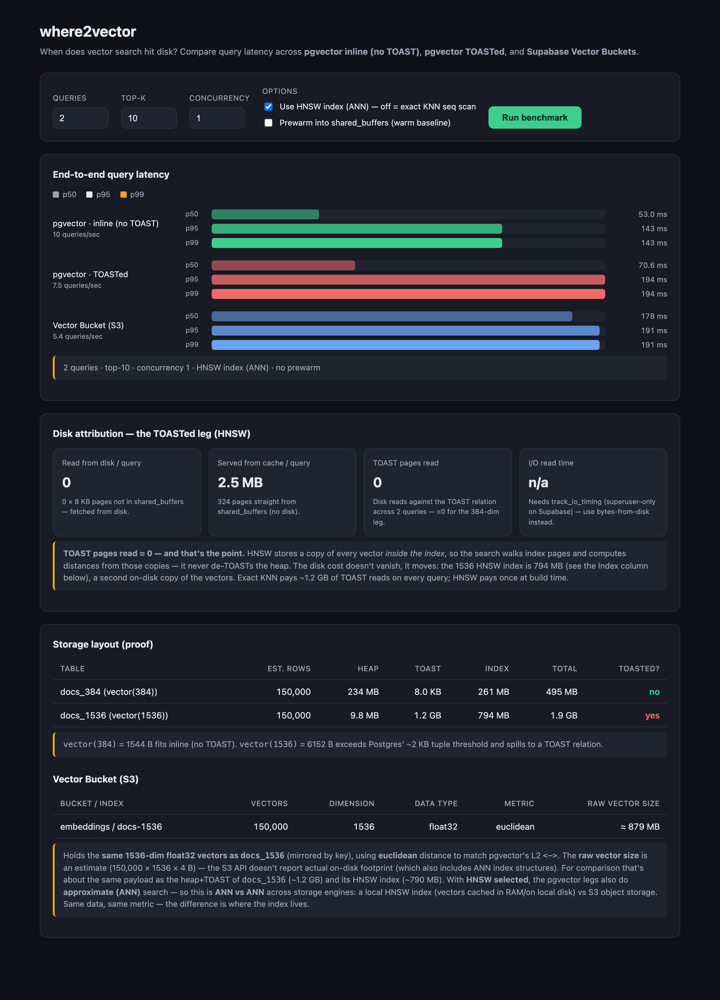

# where2vector

A benchmark demo that makes **disk latency visible** for vector search. It compares
query latency across three storage strategies and two query modes so you can see *when
and why* a vector query hits disk — and what happens when you add full-text search:

| Leg | What it is | Storage | Expected |
|---|---|---|---|
| **pgvector · inline (no TOAST)** | `vector(384)` = 1544 B | lives in the heap tuple | fast — no extra fetch |
| **pgvector · TOASTed** | `vector(1536)` = 6152 B | spills to the out-of-line **TOAST** relation | slow — extra disk fetch per row |
| **Vector Bucket (S3)** | Supabase Vector Buckets (alpha) | S3-backed object store | network/object-storage latency, scales to millions |
| **Inline hybrid** | HNSW + GIN fused with RRF inside Postgres | heap (vectors) + GIN (tsvector) | single-query database fusion |
| **Bucket hybrid** | S3 ANN + Postgres GIN fused in application code | S3 (vectors) + GIN (tsvector) | two parallel network round-trips |

The knob between the two pgvector legs is **vector dimension**: 384-dim vectors stay
inline; 1536-dim vectors exceed Postgres' ~2 KB tuple threshold and get pushed to a
TOAST relation. Reading a TOASTed row needs an extra (often random) disk fetch to
"de-TOAST" the value — that's the latency this demo surfaces.

## What you'll see

On the seeded project (150k rows/table, ~256 MB `shared_buffers`):

- **inline 384** — ~1.4 s for an exact scan, **0** TOAST reads.
- **TOASTed 1536** — **~9.5 s** (≈7× slower). The 1.24 GB TOAST relation is larger
  than cache, so the exact scan re-reads ~1.2 GB from disk on every query — and
  `pg_statio` attributes **100%** of those reads to the TOAST relation (heap reads ≈ 0).

The "disk attribution" panel reports bytes read from disk and TOAST pages read per
query (the headline, since `track_io_timing` is superuser-only on Supabase and off here).

### Exact KNN — the disk story

The TOASTed leg is ~7× slower and the disk-attribution panel pins the cost on the TOAST
relation (1.2 GB / 300k pages read per query); the inline leg reads 0 TOAST pages.



### HNSW (ANN) — the index story

Switch on HNSW and all three legs drop to tens of ms, and **TOAST reads fall to ~0** —
the index stores its own vector copies, so the search never de-TOASTs the heap (the cost
moves to the 794 MB index, visible in the storage table).



### Hybrid — the fusion story

Select **Hybrid** to compare two architectural patterns for combining vector search with
full-text search:

- **Inline ANN (baseline)** — HNSW-only on the inline 384-dim table, no FTS. The
  starting point.
- **Inline hybrid** — a single Postgres query runs HNSW + GIN in parallel as a CTE
  chain and fuses with Reciprocal Rank Fusion (`score = 1/(60+rank_vec) + 1/(60+rank_fts)`).
  The database does everything; one round-trip.
- **Bucket hybrid** — S3 ANN and Postgres GIN fire as two parallel `Promise.all` network
  calls; RRF fusion runs in TypeScript. Same result quality, two network round-trips
  instead of one SQL query.

The inline→hybrid gap shows the GIN scan + RRF overhead inside Postgres. The
inline hybrid→bucket hybrid gap shows what the distributed pattern adds.

> Regenerate screenshots with `node scripts/screenshots.mjs` while `npm run dev` is running.

## Architecture

```
supabase/migrations/   0001 extensions · 0002 tables · 0003 query RPCs ·
                       0004 seed helpers · 0005 statio · 0006 demo access ·
                       0010 hybrid (FTS + bench_hybrid_knn) ·
                       0011 hybrid bucket (bench_fts_1536)
lib/                   bench.ts (types/percentiles/EXPLAIN parse) · supabase.ts · buckets.ts
app/                   api/benchmark · api/stats · page.tsx (dashboard) · globals.css
scripts/seed.ts        server-side pgvector seeding + bucket upsert
```

The dashboard talks to Postgres only through supabase-js. The pgvector legs call
SECURITY DEFINER RPCs (`bench_knn`, `bench_explain_knn`, `bench_statio`, …) that read
a private `bench` schema. The **search type** selector has three modes:

- **KNN — exact**: sequential scan, every row de-TOASTed — the honest way to expose TOAST disk cost.
- **ANN — HNSW**: Index Scan (~120 ms on the 1536 leg vs ~9.5 s exact); requires the indexes to be pre-built (below).
- **Hybrid — vector + FTS**: always ANN. `bench_hybrid_knn` runs HNSW + GIN in one CTE; `bench_fts_1536` is the GIN leg for the bucket hybrid, with RRF fusion in TypeScript.

The **Concurrency** control runs each leg's queries through a bounded pool (1–32 in
flight) and reports **queries/sec** per leg — how each engine handles parallel load.
A nice thing to observe: concurrent exact scans on one table *share* disk reads via
Postgres synchronized scans, so the TOASTed leg's throughput can scale even while each
query stays slow.

The **Prewarm** toggle warms a table into `shared_buffers` before timing — but only if
it *fits*. The inline 384 table (234 MB) fits 256 MB `shared_buffers`, so prewarm makes
it ~12× faster (1.5 s → ~0.12 s, all cache hits). The 1536 TOAST (1.2 GB) can't fit, so
prewarm is **skipped** with a note — warming a relation larger than the buffer pool is
futile (pages evict as fast as they load) and only adds the cost of reading it once.
That "fits or it's pointless" rule is itself part of the lesson.

## Run it

The hosted project (`where2vector`, ref `enxhwnktmsqcokganivn`, us-east-1) is already
provisioned, migrated, and seeded with 150k rows/table. `.env.local` is filled with
the publishable key.

```bash
npm install
npm run dev          # http://localhost:3000 — click "Run benchmark"
```

The two pgvector legs work out of the box. Defaults run **3 queries** because the
TOASTed leg is intentionally ~10 s/query.

### Enable the Vector Bucket leg

Bucket operations require the **service-role** key (anon gets "Access denied: Invalid
role"). Add it and seed the bucket:

```bash
# .env.local → uncomment and paste from Dashboard → Project Settings → API
SUPABASE_SERVICE_ROLE_KEY=<service_role secret>

npm run seed         # creates bucket "embeddings" + euclidean index "docs-1536",
                     # then mirrors the exact docs_1536 vectors into it
```

Then re-run the dashboard — the bucket leg lights up.

### Pre-build the HNSW indexes (for ANN and Hybrid modes)

The indexes are already built on this project. HNSW indexes are **not** built from
the request path — building one over the 150k×1536 TOASTed table takes minutes and
would exceed the anon `statement_timeout` (that's the "TOAST times out when I select
HNSW" symptom). If you ever need to rebuild (e.g. after `RESET`), run it out-of-band
with no statement timeout:

```sql
-- via supabase CLI:  echo "<sql>" | supabase db query --linked --file /dev/stdin
set statement_timeout = 0;
create index if not exists docs_384_hnsw  on bench.docs_384  using hnsw (embedding extensions.vector_l2_ops);
create index if not exists docs_1536_hnsw on bench.docs_1536 using hnsw (embedding extensions.vector_l2_ops);
```

The dashboard checks `bench_index_exists(dim)` before the HNSW leg and reports a clear
message if an index is missing — it never blocks on a build.

The **GIN indexes** (`docs_384_fts_gin`, `docs_1536_fts_gin`) power the hybrid FTS legs.
They are faster to build (seconds, not minutes) and are created by migrations 0010/0011.
If you truncate and re-seed, rebuild them before running hybrid mode:

```sql
create index if not exists docs_384_fts_gin  on bench.docs_384  using gin(fts);
create index if not exists docs_1536_fts_gin on bench.docs_1536 using gin(fts);
```

### Apples-to-apples

The bucket leg is aligned with the TOASTed `vector(1536)` leg as closely as the two
engines allow:

- **Same vectors** — the seed mirrors the exact 150k `docs_1536` vectors into the
  bucket (keyed by row id), same count.
- **Same metric** — the bucket index uses **euclidean**, matching pgvector's L2 `<->`.
- **Same queries** — each benchmark iteration drives both 1536 legs with one shared
  query vector.

The one irreducible difference is the access method: the bucket does **approximate
(ANN)** search; the pgvector legs run **exact** KNN (sequential scan). That's the
storage/engine tradeoff the demo is about, not a data mismatch. (The 384 leg is a
different dimension by necessity, so it uses its own queries.)

### Re-seed / scale

```bash
PG_ROWS=300000 BUCKET_ROWS=50000 RESET=1 npm run seed   # needs the service-role key
```

More rows → larger TOAST → a bigger cold/warm gap. Keep the 1536 TOAST above
`shared_buffers` + OS cache (~1 GB here) so the exact scan stays disk-bound.

## Demo-only configuration (see `0006_demo_access.sql`)

To run on the publishable key with no server secret, this project: (1) grants the
read-only bench RPCs to `anon`, and (2) raises the `anon` `statement_timeout` to 180 s
(the disk-bound queries exceed the 3 s default). **Don't copy these into production.**

## Caveat

1536-dim also costs ~4× more distance CPU than 384-dim, so raw latency confounds
dimension with storage. The bytes-read-from-disk and TOAST-pages-read figures isolate
the storage (disk) component — which is the point of the demo.
